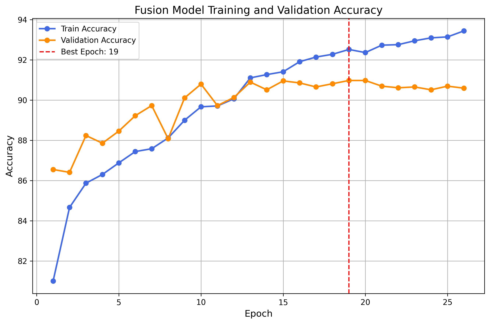
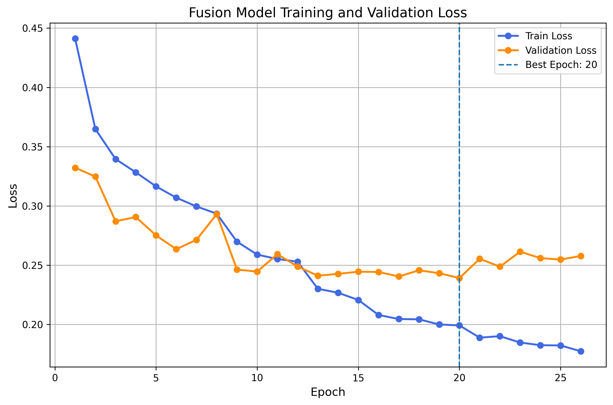
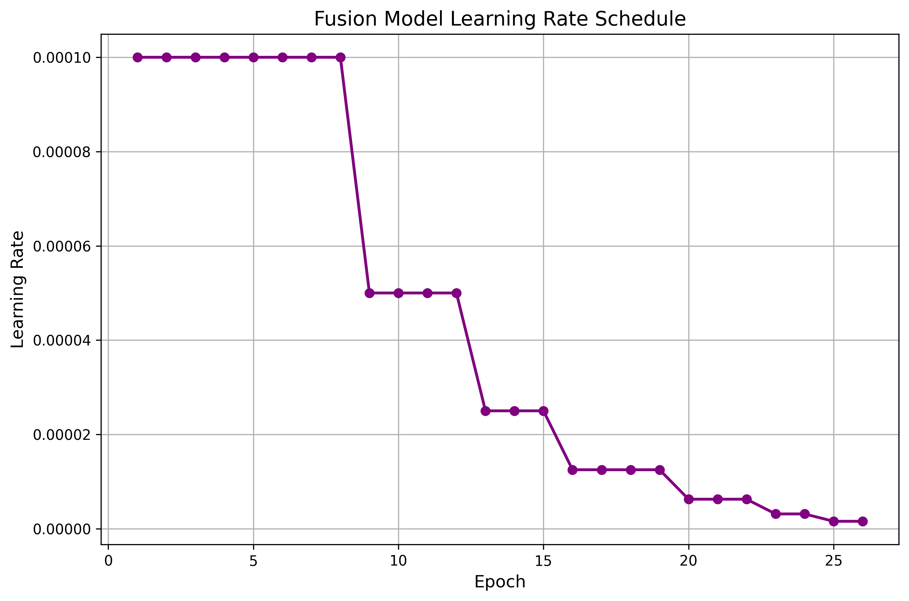
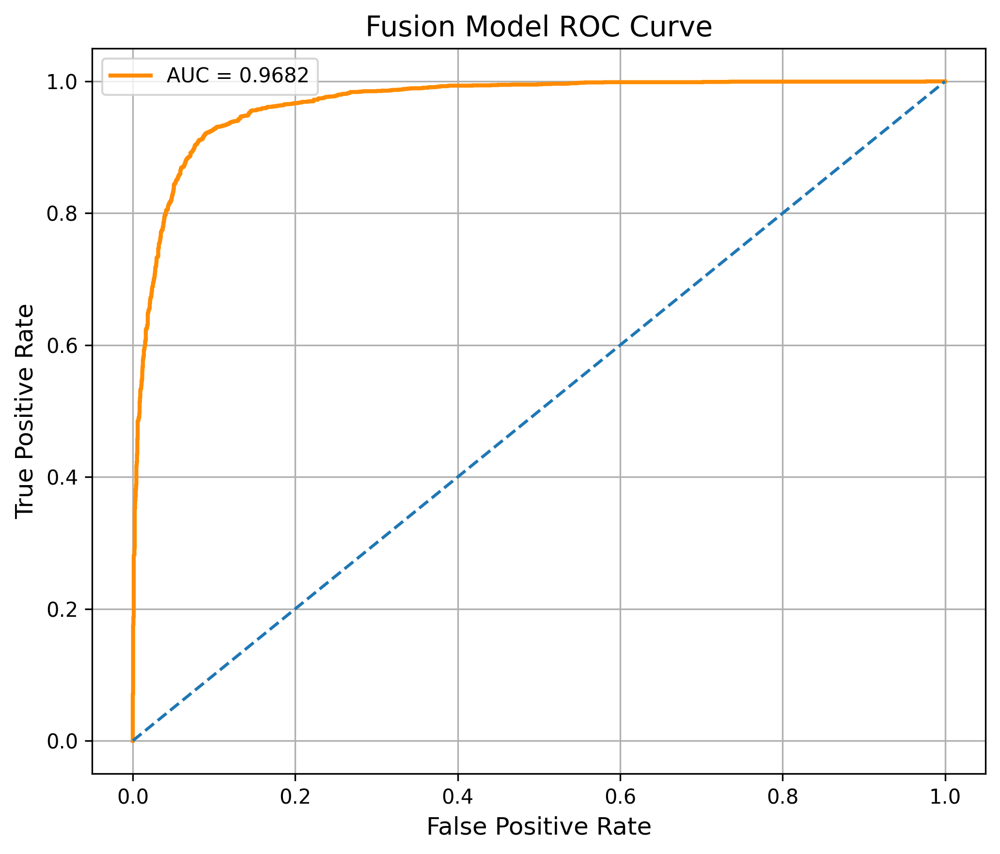
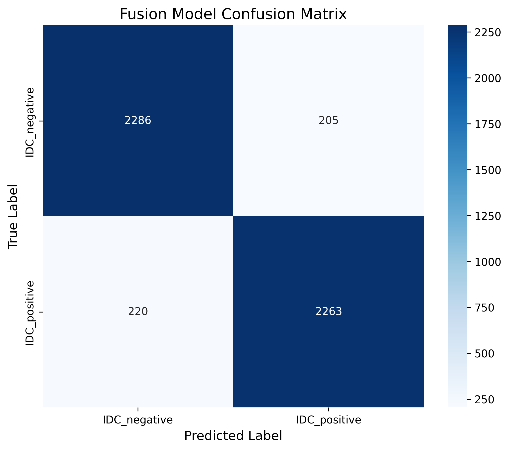
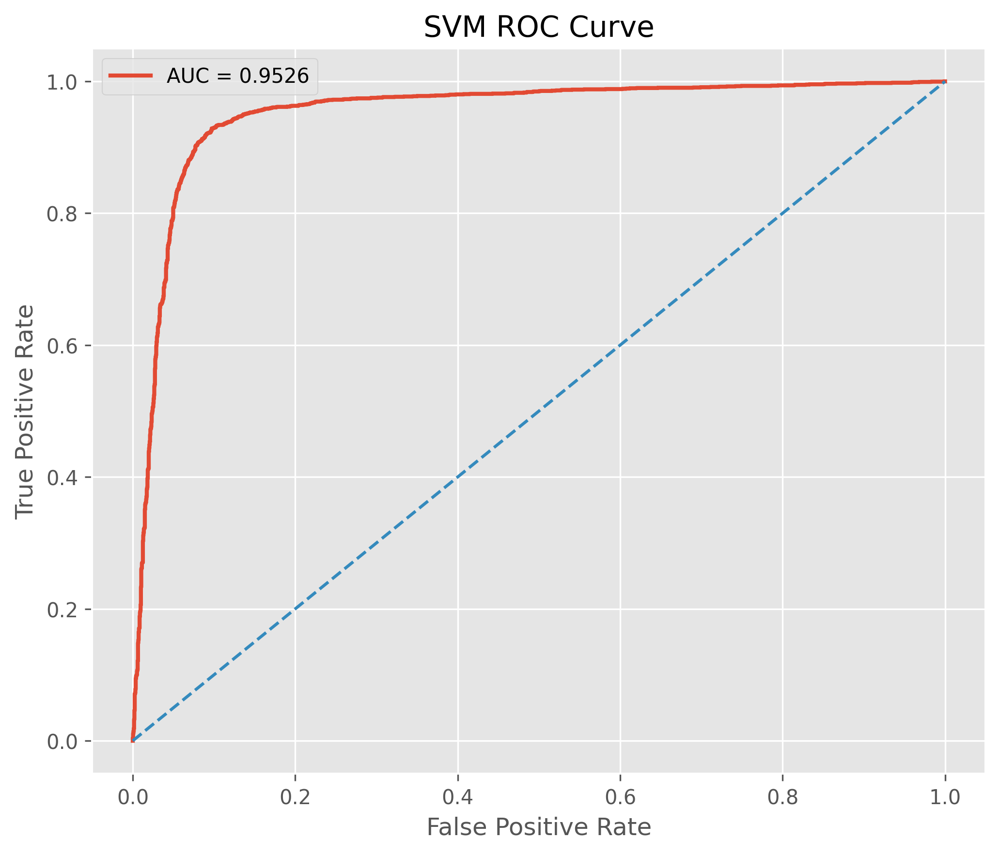
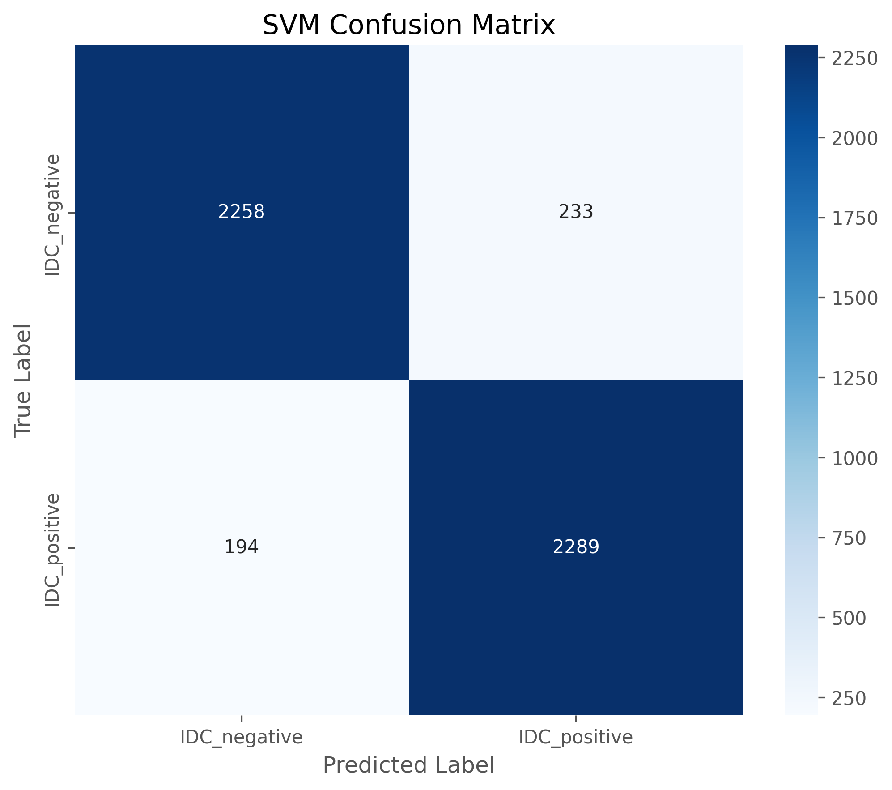

# Hybrid Deep Feature Fusion for Breast Cancer Histopathology

A modular deep learning pipeline for **binary classification of breast cancer histopathology images** (IDC-negative vs. IDC-positive). The system extracts complementary representations from three pretrained vision backbones—**Vision Transformer (ViT)**, **Swin Transformer**, and **ConvNeXt**—and fuses those features. The fused representation is classified using an end-to-end **MLP head** and is also evaluated with a separate **RBF-kernel Support Vector Machine (SVM)**.

This repository is organized as an end-to-end research codebase: dataset preparation, training, evaluation, interpretability utilities, and a Streamlit demonstration application.

---

## Overview

The project implements a **hybrid feature-fusion** approach for invasive ductal carcinoma (IDC) classification on histopathology images. Instead of relying on a single architecture, it combines:

- global self-attention features from ViT,
- hierarchical shifted-window features from Swin Transformer,
- convolutional texture features from ConvNeXt.

Fused embeddings are batch-normalized and passed to a multilayer classifier. After the fusion model is trained, the same fused embeddings are used to train a separate **RBF-SVM** classifier. Quantitative results, training curves, ROC plots, and confusion matrices are stored under `results/` and `figures/`.

A Streamlit dashboard (`app.py`) provides inference on uploaded histopathology images and presents the recorded experimental metrics. Grad-CAM modules exist for spatial attribution and are documented as supporting interpretability tools, not as the primary experimental outcome.

**Project identifiers** (from `configs/config.py`):

| Setting | Value |
| --- | --- |
| Project name | `BreastCancerTransformer` |
| Experiment name | `ConvNeXt_ViT_Swin_IDC` |
| Task | Binary IDC classification (`IDC_negative` / `IDC_positive`) |

---

## Problem Definition

Breast cancer diagnosis from histopathology requires distinguishing tissue that does **not** contain invasive ductal carcinoma from tissue that **does**. This repository treats that decision as a **binary classification** problem on RGB histopathology patches:

| Class name | Label |
| --- | --- |
| `IDC_negative` | 0 |
| `IDC_positive` | 1 |

The model outputs a single logit (`NUM_CLASSES = 1`). At inference, a sigmoid probability is compared against a threshold of **0.5**.

---

## Project Objectives

The implementation is structured around the following objectives, all reflected in the source code:

1. Build a train / validation / test split from a histopathology image archive, using equal per-class target counts defined in configuration.
2. Train a **three-backbone fusion network** with mixed precision, learning-rate scheduling, and early stopping.
3. Evaluate the fusion model on the held-out test set using accuracy, precision, recall, F1-score, ROC-AUC, balanced accuracy, a classification report, a confusion matrix, and an ROC curve.
4. Extract fused features from the trained network and train an **RBF-SVM** on those features.
5. Provide a Streamlit application for live inference and presentation of recorded results.
6. Provide Grad-CAM utilities for inspecting spatial attributions of selected images.

---

## Methodology

The end-to-end flow implemented by `main.py` is:

```text
Histopathology PNG archive
        │
        ▼
Dataset builder (train / val / test, two IDC classes)
        │
        ▼
Data loading + augmentation (224×224, ImageNet normalization)
        │
        ▼
┌──────────────────────────────────────┐
│  ViT-Base   feature extraction       │
│  Swin-Tiny  feature extraction       │
│  ConvNeXt-Tiny feature extraction    │
└──────────────────────────────────────┘
        │
        ▼
Concatenation + BatchNorm1d (hybrid fusion)
        │
        ├──► MLP classifier (1024 → 512 → 128 → 1)   [end-to-end training]
        │
        └──► StandardScaler + RBF-SVM                 [post-hoc on fused features]
        │
        ▼
Test-set evaluation (metrics, ROC, confusion matrix)
        │
        ▼
Optional Grad-CAM (interpretability utility)
```

`main.py` runs, in order: **training** → **fusion evaluation** → **SVM training/evaluation**. Grad-CAM is not executed inside `main.py`; the pipeline prints a follow-up command to run it separately.

---

## Dataset

Dataset construction is implemented in `dataset/dataset_builder.py`.

**Source archive.** The builder reads `breast-histopathology-images.zip` in the project root. PNG entries are collected from the zip; class labels come from the parent folder name:

- `"0"` → `IDC_negative`
- `"1"` → `IDC_positive`

**Configured target split sizes** (`configs/config.py`):

| Split | Images per class | Classes |
| --- | ---: | --- |
| Train | 12,000 | `IDC_negative`, `IDC_positive` |
| Validation | 2,500 | `IDC_negative`, `IDC_positive` |
| Test | 2,500 | `IDC_negative`, `IDC_positive` |

Files are shuffled with seed **42**, truncated to the counts above, and extracted into:

```text
project_data/final_dataset/
├── train/{IDC_negative, IDC_positive}
├── val/{IDC_negative, IDC_positive}
└── test/{IDC_negative, IDC_positive}
```

Raw and final dataset directories are listed in `.gitignore` and are not versioned with the code.

**Test-set support actually used in evaluation.** The saved classification reports (`results/classification_report.txt`, `results/svm_classification_report.txt`) report **4,974** test images:

| Class | Support |
| --- | ---: |
| `IDC_negative` | 2,491 |
| `IDC_positive` | 2,483 |
| **Total** | **4,974** |

That is the evaluation population behind the metrics tables below.

---

## Data Preprocessing

`dataset/dataset_loader.py` defines `BreastCancerDataset` and the train / eval transforms.

**Training transforms**

- `RandomResizedCrop` to 224×224 with scale `(0.90, 1.0)`
- Horizontal flip (`p=0.5`) and vertical flip (`p=0.5`)
- Rotation (`±25°`)
- Affine translation `(0.08, 0.08)` and scale `(0.95, 1.05)`
- Color jitter (brightness/contrast/saturation `0.10`, hue `0.02`)
- Gaussian blur (`kernel_size=3`)
- Conversion to tensor
- ImageNet normalization: mean `[0.485, 0.456, 0.406]`, std `[0.229, 0.224, 0.225]`

**Validation / test transforms**

- Resize to 224×224
- Center crop 224×224
- Tensor conversion
- Same ImageNet mean / std

Images are loaded as RGB. If a file fails to open, a blank 224×224 RGB image is used as a fallback. Loaders use batch size **32**, `pin_memory=True`, and four worker processes. Training is shuffled; validation and test are not.

---

## Patch Extraction

`dataset/patch_extractor.py` is a **standalone utility**, separate from the zip-based dataset builder.

For a given image path it:

1. Reads the image with OpenCV and converts BGR → RGB.
2. Resizes it to **224×224**.
3. Extracts a non-overlapping grid of **56×56** patches (`PATCH_SIZE = 56`), which yields an expected **16** patches (`NUM_PATCHES = 16`) on a 224×224 canvas.
4. Drops incomplete border patches and patches whose mean intensity is **greater than 240** (treated as empty / background).
5. Optionally draws a patch grid, prints intensity statistics, and saves a visualization to `figures/patches/patch_visualization.png`.

This module is intended for patch-level inspection and visualization. The training dataset itself is built by copying PNG files from the zip archive, then resizing them through the dataloader transforms described above.

---

## Vision Transformer (ViT)

Implemented in `models/vit_model.py`.

| Item | Implementation |
| --- | --- |
| Backbone | `timm.create_model("vit_base_patch16_224", pretrained=True, num_classes=0, global_pool="avg")` |
| Features | `backbone.num_features` after global average pooling |
| Standalone head | Linear `feature_dim → 512` → BatchNorm → GELU → Dropout `0.25` → Linear `512 → 256` → BatchNorm → GELU → Dropout `0.20` → Linear `256 → 1` |
| Weight init | Xavier uniform on linear layers; biases set to 0 |
| Freeze / unfreeze | `freeze_backbone()` / `unfreeze_backbone()` |

`extract_features()` returns the backbone embedding (cast to float). In the fusion model, only this embedding is used; the standalone ViT classifier head is not part of the fusion forward path.

---

## Swin Transformer

Implemented in `models/swin_model.py`.

| Item | Implementation |
| --- | --- |
| Backbone | `timm.create_model("swin_tiny_patch4_window7_224", pretrained=True, num_classes=0, global_pool="avg")` |
| Features | `backbone.num_features` after global average pooling |
| Standalone head | Linear `feature_dim → 512` → BatchNorm → GELU → Dropout `0.20` → Linear `512 → 256` → BatchNorm → GELU → Dropout `0.20` → Linear `256 → 1` |
| Freeze / unfreeze | `freeze_backbone()` / `unfreeze_backbone()` |

Swin contributes hierarchical shifted-window representations that complement ViT’s global attention.

---

## ConvNeXt

Implemented in `models/convnext_model.py`.

| Item | Implementation |
| --- | --- |
| Backbone | `timm.create_model("convnext_tiny", pretrained=True, num_classes=0, global_pool="avg")` |
| Features | `backbone.num_features` after global average pooling |
| Standalone head | Linear `feature_dim → 512` → BatchNorm → GELU → Dropout `0.25` → Linear `512 → 256` → BatchNorm → GELU → Dropout `0.20` → Linear `256 → 1` |
| Freeze / unfreeze | `freeze_backbone()` / `unfreeze_backbone()` |

ConvNeXt supplies convolutional inductive bias for local texture, which is also the default spatial branch used by the Grad-CAM utilities.

---

## Feature Extraction

Each backbone is loaded with `num_classes=0` and `global_pool="avg"`, so a forward pass through `extract_features()` yields a 1-D embedding per image.

`FeatureFusionModel.extract_features()` (`models/feature_fusion.py`) runs all three backbones on the same input tensor and concatenates the three embeddings along the feature dimension:

```text
fused = concat(ViT_features, Swin_features, ConvNeXt_features)
fused = BatchNorm1d(fused)
```

The fused vector is also the representation consumed by the RBF-SVM pipeline (`training/train_svm.py`).

---

## Hybrid Feature Fusion

`models/feature_fusion.py` defines `FeatureFusionModel`:

1. Instantiate `ViTModel`, `SwinModel`, and `ConvNeXtModel` (pretrained by default).
2. Concatenate the three embeddings and apply `BatchNorm1d` over the total dimension.
3. Classify with an MLP:

| Layer | Operation |
| --- | --- |
| FC1 | Linear `total_dim → 1024` + BatchNorm + GELU + Dropout `0.20` |
| FC2 | Linear `1024 → 512` + BatchNorm + GELU + Dropout `0.15` |
| FC3 | Linear `512 → 128` + BatchNorm + GELU + Dropout `0.15` |
| Output | Linear `128 → 1` (binary logit) |

Linear layers in the fusion classifier are initialized with Xavier uniform weights and zero biases. `forward(..., return_features=True)` returns both the logit and the fused embedding.

`freeze_backbones()` / `unfreeze_backbones()` toggle `requires_grad` on all three backbones. The training loop calls `unfreeze_backbones()` when the 0-based epoch counter equals `FREEZE_EPOCHS` (`2`), i.e. at the start of the third epoch. The loop does not call `freeze_backbones()` before that.

The Streamlit app and the evaluation scripts load **this fusion model** from `checkpoints/best_model.pth`.

---

## RBF-SVM Classification

Implemented in `training/train_svm.py`.

After the fusion checkpoint is trained:

1. Load `FeatureFusionModel` from `checkpoints/best_model.pth`.
2. Extract fused features from the **train** and **test** loaders (`model.extract_features`, mixed precision when AMP is enabled).
3. Fit a scikit-learn `Pipeline`:
   - `StandardScaler`
   - `SVC(kernel="rbf", probability=True, C=2.0, gamma="auto", class_weight="balanced", random_state=42)`
4. Save the pipeline to `checkpoints/svm_model.pkl`.
5. Write metrics to `results/svm_results.txt` and `results/svm_classification_report.txt`.
6. Save `figures/svm_confusion_matrix.png` and `figures/svm_roc_curve.png`.

SVM is therefore a **second classifier on frozen fused embeddings**, not a replacement for the MLP during backbone training.

---

## Training Pipeline

Entry points:

- Full pipeline: `python main.py`
- Training only: `python -m training.train_pipeline`

`training/train_pipeline.py` trains **only** `FeatureFusionModel` (the three-backbone fusion network).

| Setting | Value in `configs/config.py` / training code |
| --- | --- |
| Input size | 224×224 RGB |
| Batch size | 32 |
| Optimizer | AdamW |
| Learning rate | `1e-4` |
| Weight decay | `1e-4` |
| Loss | `BCEWithLogitsLoss` |
| Epochs (configured maximum) | 35 |
| Early stopping patience | 7 (no improvement in validation accuracy) |
| Scheduler | `ReduceLROnPlateau` (`mode="min"`, factor `0.5`, patience `1`) on validation loss |
| Mixed precision | CUDA AMP (`GradScaler`, `autocast`) |
| Gradient clipping | max-norm `1.0` |
| Best checkpoint | `checkpoints/best_model.pth` (highest validation accuracy) |
| Last checkpoint | `checkpoints/last_model.pth` (every epoch) |
| Train log | `logs/train_log.csv` |

After training, `evaluation/visualization.py` writes:

- `figures/loss_curve.png`
- `figures/accuracy_curve.png`
- `figures/learning_rate_curve.png`
- `results/training_summary.txt`
- `results/final_results.txt` (best validation accuracy and the validation loss stored with that best-accuracy checkpoint)

The recorded run in `logs/train_log.csv` contains **26** epochs. That length is consistent with early stopping (best validation accuracy at **epoch 19**, patience **7**).

`quick_test.py` builds a fusion model, prints parameter counts, and runs a dummy forward pass. It does not train or evaluate on data.

---

## Evaluation Methodology

`evaluation/metrics.py` (`evaluate_model`) loads the best fusion checkpoint and the test dataloader.

For each batch:

1. Forward pass through `FeatureFusionModel`.
2. Sigmoid on the logit.
3. Predicted class: probability `> 0.5`.

Reported metrics (scikit-learn):

- Accuracy
- Precision
- Recall
- F1-score
- ROC-AUC (using predicted probabilities)
- Balanced accuracy
- Per-class classification report
- Confusion matrix
- ROC curve

Outputs:

| File | Content |
| --- | --- |
| `results/metrics.txt` | Scalar test metrics |
| `results/classification_report.txt` | Per-class report |
| `figures/confusion_matrix.png` | Fusion confusion matrix |
| `figures/roc_curve.png` | Fusion ROC curve |
| `results/all_labels.npy`, `results/all_probabilities.npy` | Arrays used for metric computation (gitignored) |

The SVM branch uses the same metric set on fused features (`results/svm_results.txt`).

---

## Experimental Results

Values below are copied from the files currently stored in `results/` and `logs/train_log.csv`. Percentages are the stored decimals multiplied by 100.

Training and validation numbers come from the fusion-model training run. Final test numbers come from held-out evaluation after that run (`results/metrics.txt` for the fusion MLP; `results/svm_results.txt` for the RBF-SVM).

### Training and validation results (fusion model)

These metrics are **not** test-set scores. They describe model selection on the validation split.

From `results/training_summary.txt`, `results/final_results.txt`, and `logs/train_log.csv`:

| Quantity | Value | Source |
| --- | --- | --- |
| Epochs recorded | **26** | `logs/train_log.csv` |
| Best validation accuracy | **90.97%** (`90.9731` in the training summary) | `training_summary.txt`, `final_results.txt` |
| Best epoch (by validation accuracy) | **19** | `training_summary.txt` |
| Best validation loss (minimum over recorded epochs) | **0.2391** | `training_summary.txt` |
| Validation loss stored with the best-accuracy checkpoint | **0.2432** | `final_results.txt` |

The two validation-loss numbers differ because the training summary records the **minimum validation loss** across epochs, while `final_results.txt` records the validation loss at the epoch of **best validation accuracy**.

Corresponding training/validation plots are `figures/accuracy_curve.png`, `figures/loss_curve.png`, and `figures/learning_rate_curve.png`.

### Final test results

All scores in this subsection are from the **held-out test set** (4,974 images in the saved reports). They are the headline classification results of the project.

#### Fusion MLP (test set)

From `results/metrics.txt`:

| Metric | Score |
| --- | ---: |
| Accuracy | **91.46%** |
| Precision | **91.69%** |
| Recall | **91.14%** |
| F1-score | **91.42%** |
| ROC-AUC | **96.82%** |
| Balanced accuracy | **91.46%** |

Per-class report (`results/classification_report.txt`):

| Class | Precision | Recall | F1-score | Support |
| --- | ---: | ---: | ---: | ---: |
| IDC_negative | 0.91 | 0.92 | 0.91 | 2,491 |
| IDC_positive | 0.92 | 0.91 | 0.91 | 2,483 |
| **Accuracy / total** |  |  | **0.91** | **4,974** |
| Macro average | 0.91 | 0.91 | 0.91 | 4,974 |
| Weighted average | 0.91 | 0.91 | 0.91 | 4,974 |

Confusion-matrix counts from `figures/confusion_matrix.png`:

|  | Predicted negative | Predicted positive |
| --- | ---: | ---: |
| **True negative** | 2,286 | 205 |
| **True positive** | 220 | 2,263 |

#### RBF-SVM on fused features (test set)

From `results/svm_results.txt`:

| Metric | Score |
| --- | ---: |
| Accuracy | **91.42%** |
| Balanced accuracy | **91.42%** |
| Precision | **90.76%** |
| Recall | **92.19%** |
| F1-score | **91.47%** |
| ROC-AUC | **95.26%** |

Per-class report (`results/svm_classification_report.txt`):

| Class | Precision | Recall | F1-score | Support |
| --- | ---: | ---: | ---: | ---: |
| IDC_negative | 0.92 | 0.91 | 0.91 | 2,491 |
| IDC_positive | 0.91 | 0.92 | 0.91 | 2,483 |
| **Accuracy / total** |  |  | **0.91** | **4,974** |

Confusion-matrix counts from `figures/svm_confusion_matrix.png`:

|  | Predicted negative | Predicted positive |
| --- | ---: | ---: |
| **True negative** | 2,258 | 233 |
| **True positive** | 194 | 2,289 |

On this recorded test set, the fusion MLP has slightly higher accuracy and ROC-AUC; the RBF-SVM has slightly higher recall and F1-score.

---

## Metrics Table

Final **test-set** comparison of the two classifiers (same 4,974 images; values from `results/metrics.txt` and `results/svm_results.txt`). These are not training or validation scores.

| Metric | Fusion MLP | RBF-SVM on fused features |
| --- | ---: | ---: |
| Accuracy | 91.46% | 91.42% |
| Precision | 91.69% | 90.76% |
| Recall | 91.14% | 92.19% |
| F1-score | 91.42% | 91.47% |
| ROC-AUC | 96.82% | 95.26% |
| Balanced accuracy | 91.46% | 91.42% |
| Test support | 4,974 | 4,974 |

---

## Existing Evaluation Figures

The following figures are present in `figures/`. Training/validation plots are shown first; test-set plots follow. Grad-CAM outputs are not included here.

### Training and validation

**Fusion model — training and validation accuracy**



**Fusion model — training and validation loss**



**Fusion model — learning-rate schedule**



### Final test set

**Fusion model — test ROC curve** (AUC = 0.9682)



**Fusion model — test confusion matrix**



**RBF-SVM — test ROC curve** (AUC = 0.9526)



**RBF-SVM — test confusion matrix**



---

## Application (`app.py`)

`app.py` is a **Streamlit research / presentation dashboard**. It is inference-only: it does not retrain models.

Documented run command at the bottom of the file:

```bash
streamlit run app.py
```

**What the application actually does**

1. **Loads the trained fusion checkpoint**  
   `FeatureFusionModel` weights from `checkpoints/best_model.pth`, moved to `CFG.DEVICE` (`cuda` if available, otherwise `cpu`), set to `eval()`.

2. **Live Diagnosis tab**  
   Accepts an uploaded image (`png`, `jpg`, `jpeg`, `tif`, `tiff`, `bmp`). The image is converted to RGB, resized to 224×224, normalized with ImageNet statistics, and passed through the fusion model. The sigmoid probability is mapped to `IDC_negative` / `IDC_positive` at threshold 0.5. The UI shows class probabilities and, if Matplotlib PDF export succeeds, a downloadable one-page “AI Clinical Histopathology Report” PDF. The report states it is a research demonstration and **not for clinical use**.

3. **Training Analytics tab**  
   Replays a **simulation** of the recorded training log (`logs/train_log.csv`, first 26 epochs). If the CSV is missing, a synthetic fallback trajectory is shown. This is explicitly a demonstration; it does not train the network. It also displays the saved accuracy and loss curves when those PNG files exist.

4. **ROC Analysis / Confusion Matrix tabs**  
   Display `figures/roc_curve.png`, `figures/svm_roc_curve.png`, `figures/confusion_matrix.png`, and `figures/svm_confusion_matrix.png` if present.

5. **Model Comparison tab**  
   Compares hardcoded fusion vs. SVM metric dictionaries that match `results/metrics.txt` and `results/svm_results.txt`.

6. **Classification Report tab**  
   Shows per-class precision / recall / F1 / support consistent with `results/classification_report.txt` (2,491 / 2,483; overall accuracy 91.46%; n = 4,974).

7. **Research Summary tab**  
   Renders a pipeline graphic (dataset → patch extraction → three encoders → fusion → SVM → prediction) and lists recorded headline metrics.

8. **Sidebar**  
   Presentation-mode toggle, device/checkpoint status, architecture pills (ViT-Base, Swin-Tiny, ConvNeXt-Tiny), configured per-class split sizes, and the recorded best validation accuracy (90.97%, epoch 19) and test accuracy (91.46%).

The dashboard is **not** a clinical diagnostic device. Predictions depend on a local `best_model.pth` checkpoint; if the file is missing, live inference reports an error.

### Application screenshot placeholders

Screenshots of the Streamlit UI are **not** in this repository. No application images are claimed here. After capturing the running app, they can be inserted below.

**Home / hero and system status**

> *[Screenshot to be added]*

**Live Diagnosis (upload and prediction)**

> *[Screenshot to be added]*

**Training Analytics**

> *[Screenshot to be added]*

**ROC Analysis and Confusion Matrix tabs**

> *[Screenshot to be added]*

**Model Comparison and Classification Report**

> *[Screenshot to be added]*

---

## Grad-CAM Implementation

Grad-CAM is an **optional interpretability module**. Visualizations produced by it are supporting diagnostics; they are **not** treated as the main experimental results of this project.

Two implementations exist:

### `evaluation/gradcam.py`

- Generic `GradCAM` class with forward and full-backward hooks.
- Resolves a target layer for ViT (`blocks[-1].norm1`), Swin (`layers[-1].blocks[-1]`), ConvNeXt (`stages[-2].blocks[-1]`), or the fusion model (default spatial branch: ConvNeXt).
- Converts ViT/Swin token maps or ConvNeXt spatial maps to `(C, H, W)`, computes ReLU-weighted CAMs, and can write gallery outputs under `figures/gradcam_gallery/` (that directory is gitignored).
- `main.py` suggests running: `python -m evaluation.gradcam`.

### `evaluation/gradcam_main.py`

- Loads the **full fusion model** for inference.
- Attributes spatial attention **only through ConvNeXt** (`backbone.stages[-2]`). ViT and Swin are not used for the heatmap.
- Processes four manually listed files under `evaluation/selected_images/` (`positive_1.png`, `positive_2.png`, `negative_1.png`, `negative_2.png`).
- Writes originals, overlays, heatmaps, CAM maps, panels, and an optional grid to `figures/gradcam_final/` (gitignored).
- Toggle `STRONG_PUBLICATION_MODE` (currently `True`) vs. a softer TURBO overlay mode. Publication mode applies additional display post-processing (percentile mask, Gaussian blob, JET colormap); the CAM math itself remains gradient-based GAP weighting.

Run:

```bash
python evaluation/gradcam_main.py
```

Generated Grad-CAM image galleries are excluded from version control (`.gitignore`) and are omitted from the figures section above on purpose.

---

## Repository Structure

Source layout currently in the repository:

```text
transformers_model/
├── README.md
├── .gitignore
├── app.py
├── main.py
├── quick_test.py
├── requirements.txt
├── transformers_model.pyproj
├── transformers_model.sln
│
├── configs/
│   ├── __init__.py
│   └── config.py
│
├── dataset/
│   ├── dataset_builder.py
│   ├── dataset_loader.py
│   └── patch_extractor.py
│
├── models/
│   ├── vit_model.py
│   ├── swin_model.py
│   ├── convnext_model.py
│   └── feature_fusion.py
│
├── training/
│   ├── train_pipeline.py
│   └── train_svm.py
│
├── evaluation/
│   ├── __init__.py
│   ├── metrics.py
│   ├── visualization.py
│   ├── gradcam.py
│   └── gradcam_main.py
│
├── utils/
│   ├── __init__.py
│   └── seed_utils.py
│
├── figures/                         # evaluation plots embedded above
├── logs/                            # gitignored runtime directory; this workspace contains train_log.csv
└── results/
    ├── classification_report.txt
    ├── final_results.txt
    ├── metrics.txt
    ├── pipeline_summary.txt
    ├── svm_classification_report.txt
    ├── svm_results.txt
    └── training_summary.txt
```

`.gitignore` excludes datasets (`project_data/`, `breast-histopathology-images/`), checkpoints (`checkpoints/`, `*.pth`, `*.pkl`), `logs/`, generated Grad-CAM folders, and related runtime artifacts. `configs/config.py` creates `checkpoints/`, `logs/`, `figures/`, and `results/` if they are missing. The epoch count in the results section uses the local `logs/train_log.csv` from the recorded run. The project report PDF is linked in the Project Report section.

---

## Installation

Python 3 with CUDA-capable PyTorch is recommended when a GPU is available (`CFG.DEVICE` selects `cuda` if present).

```bash
git clone https://github.com/03betulpehlivan/breast-cancer-histopathology-classification.git
cd breast-cancer-histopathology-classification

python -m venv .venv
# Windows
.venv\Scripts\activate
# Linux / macOS
# source .venv/bin/activate

pip install -r requirements.txt
```

Declared dependencies in `requirements.txt`:

- `streamlit>=1.28.0`
- `pillow>=10.0.0`
- `numpy>=1.24.0`
- `matplotlib>=3.7.0`
- `torch>=2.0.0`
- `torchvision>=0.15.0`
- `timm>=0.9.0`
- `pandas>=2.0.0`

The pipeline source also imports packages that are **not** listed in `requirements.txt`, including `opencv-python` (`cv2`), `scikit-learn`, `seaborn`, `tqdm`, and `joblib`. Install those as needed for training, SVM, evaluation, and patch extraction.

Place `breast-histopathology-images.zip` in the project root before building the dataset. Trained weights belong in `checkpoints/best_model.pth` for evaluation and for `app.py`.

---

## Usage

**1. Build the dataset** (requires the zip archive):

```bash
python dataset/dataset_builder.py
```

**2. Run the full pipeline** (train fusion model, evaluate, train SVM):

```bash
python main.py
```

**3. Individual stages**

```bash
python -m training.train_pipeline
python -m evaluation.metrics
python -m training.train_svm
```

**4. Streamlit application** (requires `checkpoints/best_model.pth`):

```bash
streamlit run app.py
```

**5. Sanity check (no dataset required)**

```bash
python quick_test.py
```

**6. Grad-CAM (optional)**

```bash
python -m evaluation.gradcam
python evaluation/gradcam_main.py
```

---

## Technologies

| Area | Libraries / models used in this repository |
| --- | --- |
| Deep learning | PyTorch, torchvision, timm |
| Backbones | `vit_base_patch16_224`, `swin_tiny_patch4_window7_224`, `convnext_tiny` |
| Classical ML | scikit-learn (`SVC`, `StandardScaler`, metrics), joblib |
| Data | Pillow, OpenCV, NumPy |
| Visualization | Matplotlib, seaborn |
| Application | Streamlit |
| Training utilities | tqdm, PyTorch AMP |

---

## Reproducibility

- Global seed **42** is set in `configs/config.py` (`set_seed`) and again from `main.py` via `utils/seed_utils.py`.
- Dataset splitting in `dataset_builder.py` also uses `random.seed(42)`.
- SVM uses `random_state=CFG.SEED`.
- Checkpoints, logs, raw/final datasets, and generated Grad-CAM folders are gitignored so the tracked tree stays source-and-result focused.
- Numeric claims in this README are taken from `results/*.txt` produced by the recorded run.
- Exact bitwise reproducibility on GPU is not guaranteed: `utils/seed_utils.py` sets `torch.backends.cudnn.deterministic = False` (while still disabling CuDNN benchmark and enabling TF32). `train_pipeline.py` additionally sets `torch.backends.cudnn.benchmark = True` during training.

To reproduce the recorded experiment, use the same configuration values in `configs/config.py`, the same zip-derived split procedure, and the training/evaluation scripts above. Results may still vary slightly across hardware and library versions.

---

## Project Report

The written project report is included in this repository:

**[View the Full Project Report](./Hybrid%20Deep%20Feature%20Fusion%20for%20Breast%20Cancer%20Histopathology%20.pdf)**

---

## Future Improvements

The following items are possible extensions; they are **not** implemented in the current codebase:

- Add the training-stack libraries (`scikit-learn`, `opencv-python`, `seaborn`, `tqdm`, `joblib`) to the declared requirements so a fresh environment matches the imports.
- Evaluate on additional public histopathology collections beyond the current zip-based IDC split.
- Search SVM hyperparameters (`C`, `gamma`) and fusion-head regularization more systematically.
- Call `freeze_backbones()` explicitly at the start of training if a true freeze-then-unfreeze schedule is intended (the loop currently only unfreezes when the epoch counter equals `FREEZE_EPOCHS`).
- Keep Grad-CAM as a qualitative aid and, if used in reports, document display post-processing (`STRONG_PUBLICATION_MODE`) separately from the CAM computation.
- External clinical validation would be required before any diagnostic use; the application already labels itself as a research demo.

---

## Author

**Fatma Betül Pehlivan**  
Computer Engineering — hybrid deep feature fusion for breast cancer histopathology classification.

This work is a research and educational project. Model outputs must not be used as medical advice or as a substitute for professional pathological diagnosis.
